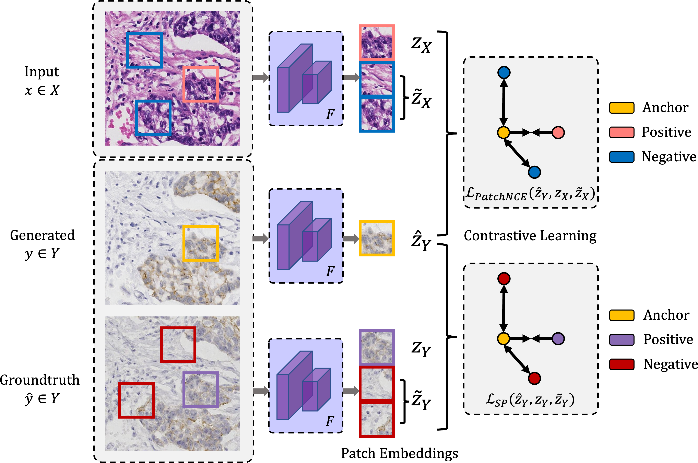

# Adaptive Supervised PatchNCE Loss for Learning H&E-to-IHC Stain Translation with Inconsistent Groundtruth Image Pairs (MICCAI 2023)
### Fangda Li, Zhiqiang Hu, Wen Chen, Avinash Kak

<br>
<p align="center">

</p>
<br>

> Immunohistochemical (IHC) staining highlights the molecular information critical to diagnostics in tissue samples. However, compared to H&E staining, IHC staining can be much more expensive in terms of both labor and the laboratory equipment required. This motivates recent research that demonstrates that the correlations between the morphological information present in the H&E-stained slides and the molecular information in the IHC-stained slides can be used for H&E-to-IHC stain translation. However, due to a lack of pixel-perfect H&E-IHC groundtruth pairs, most existing methods have resorted to relying on expert annotations. To remedy this situation, we present a new loss function, Adaptive Supervised PatchNCE (ASP), to directly deal with the input to target inconsistencies in a proposed H&E-to-IHC image-to-image translation framework. The ASP loss is built upon a patch-based contrastive learning criterion, named Supervised PatchNCE (SP), and augments it further with weight scheduling to mitigate the negative impact of noisy supervision. Lastly, we introduce the Multi-IHC Stain Translation (MIST) dataset, which contains aligned H&E-IHC patches for 4 different IHC stains critical to breast cancer diagnosis. In our experiment, we demonstrate that our proposed method outperforms existing image-to-image translation methods for stain translation to multiple IHC stains.

## Downloading the MIST Dataset
The full dataset can be accessed from [Google Drive](https://drive.google.com/drive/folders/146V99Zv1LzoHFYlXvSDhKmflIL-joo6p?usp=sharing) and [Baidu Cloud](https://pan.baidu.com/s/1wWlt6tUv4u8bMWU99dj-5g) (code: 6pme).

The MIST dataset contains the following numbers of 1024x1024 H&E-IHC patch pairs at 0.4661 micron-per-pixel or 20X:
- HER2: 4642 training and 1000 testing from 64 WSIs
- Ki67: 4361 training and 1000 testing from 56 WSIs
- ER: 4153 training and 1000 testing from 56 WSIs
- PR: 4139 training and 1000 testing from 56 WSIs

H&E-to-IHC stain translation results on the MIST images can be found in our [paper](https://arxiv.org/abs/2303.06193).

## Requirements
Clone this repo then install the dependencies using:
```bash
conda env create -f environment.yml
```
Note that we used `pytorch==1.12.1` and a RTX3090 GPU for all experiments.

## Training from Scratch
We use `experiments/mist_launcher.py` to generate the command line arguments for training and testing. More details on the parameters used in training our models can be found in that launcher file.

To train a model from scratch on the MIST dataset:
```bash
python -m experiments mist train 0
```

## Testing and Evaluation
Again the same `mist_launcher.py` can be used for testing:
```bash
python -m experiments mist test 0
```

We provide ASP-pretrained models on the BCI and our MIST dataset.
The weights can be downloaded from [Google Drive](https://drive.google.com/drive/folders/11a3_4cyQY1bgBiRKnqtM7JGis5CPoVM6?usp=share_link).
To use one of the provided models for testing, modify the `name` and `checkpoints` arguments in the launch option. 
For example, to use `mist_her2_lambda_linear`:
```
name="mist_her2_lambda_linear",
checkpoints_dir='/path/to/pretrained/'
```

The evaluation code that was used to generated the results in the paper is provided in `evaluate.py`.

## Acknowledgement
If you use this code or our MIST dataset for your research, please cite our [paper](https://arxiv.org/abs/2303.06193).

This repo is built upon [Contrastive Unpaired Translation (CUT)](https://github.com/taesungp/contrastive-unpaired-translation).
